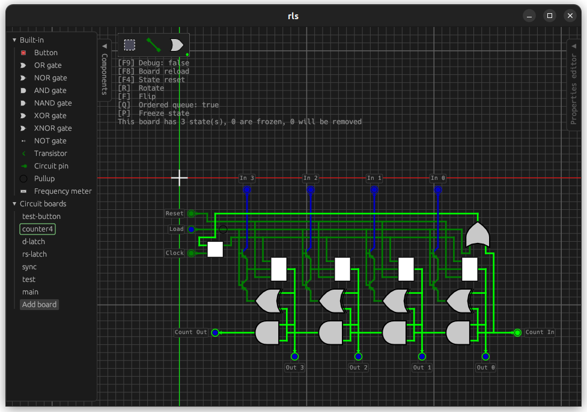

## Cuprous Logic Simulator
Renamed from RLS (Rust Logic Simulator)

Logisim-inspired logic circuits simulator

### Global TODOs

- [Done] Place circuit boards as circuits
- [Done] Circuit controls 
- [Working] Circuit designer for circuit boards

- [Done] Rename the project

- UI descriptions, tooltips, hints, etc
- Better UI, more tabs
- Proper keybinds, some mobile support

- Fully custom pins that can interface with other wires in other circuits (labels, seamless pins)
- More components (LEDs, 7-segments...)

- Embed as `iframe`s
- Some sort of plugin api
- Separate into backend and frontend crates
- Figure out themes
- Proper mobile support
- [WIP] Proper errors

## Local TODOs

- Rotate selection
- Remove wire with Wire tool
- Warning to replace circuits that don't match latest pin layout
- Maybe show circuit pin labels in paste
- Update SVGs

## Auto builds

Automatic builds are available [here for Linux](https://nightly.link/Ved-s/cuprous/workflows/rust-build-deploy/master/build-x86_64-unknown-linux-gnu.zip) and [here for Windows](https://nightly.link/Ved-s/cuprous/workflows/rust-build-deploy/master/build-x86_64-pc-windows-gnu.zip) for x86_64.

These links depend on [nightly.link](https://nightly.link) and will not work if the site is down or 90 days have passed from last build.

### Web version

Web version is available [here](https://ved-s.github.io/cuprous).
It's less precise due to browser limitations.